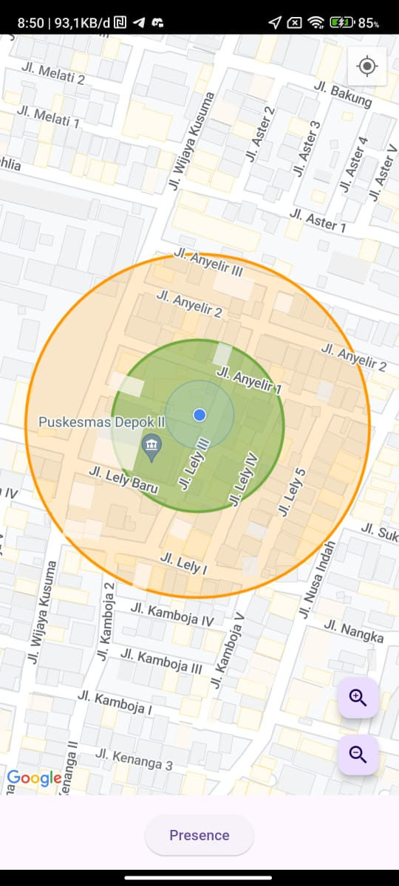
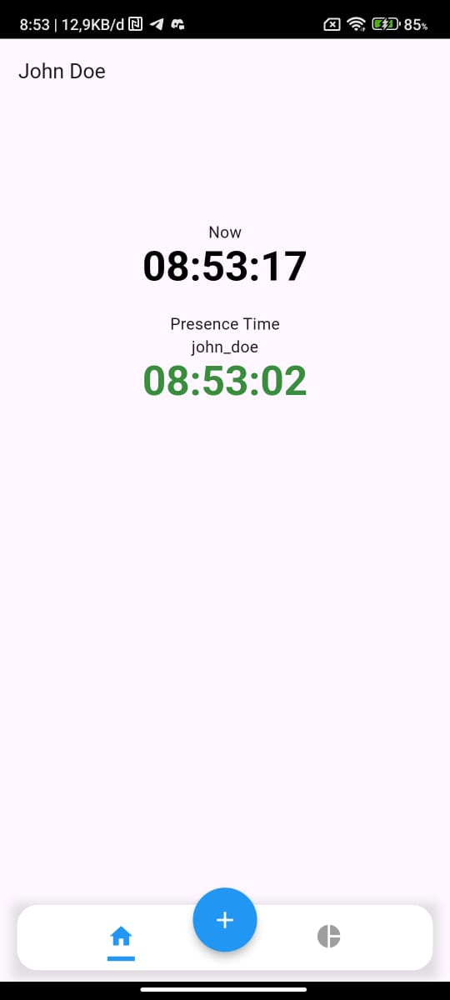
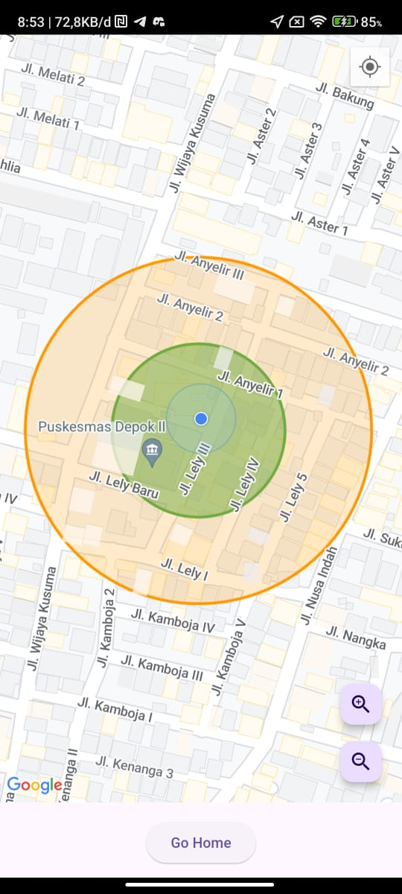
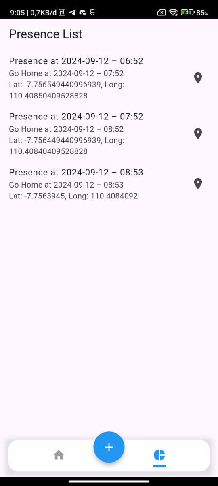

# Presence App

A geolocation-based employee attendance app uses GPS to record attendance only when employees are at the workplace radius. ## Presence App 

* Using Google Maps API
* Using Local Database SQLite

  
## UI Screenshots

   
  